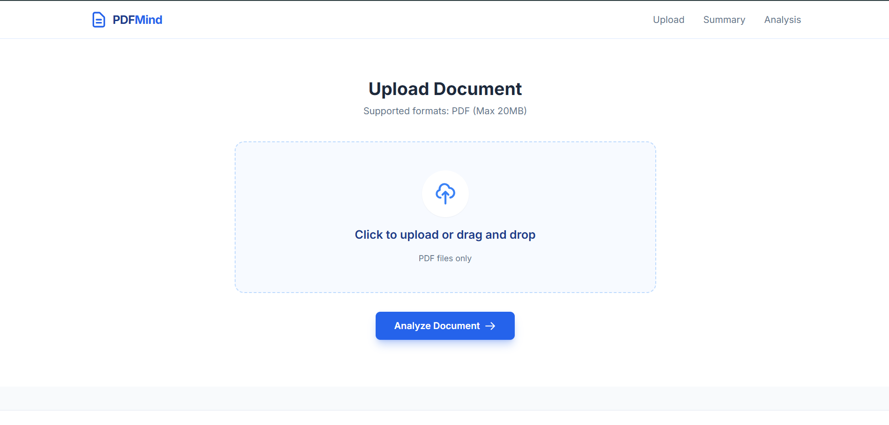
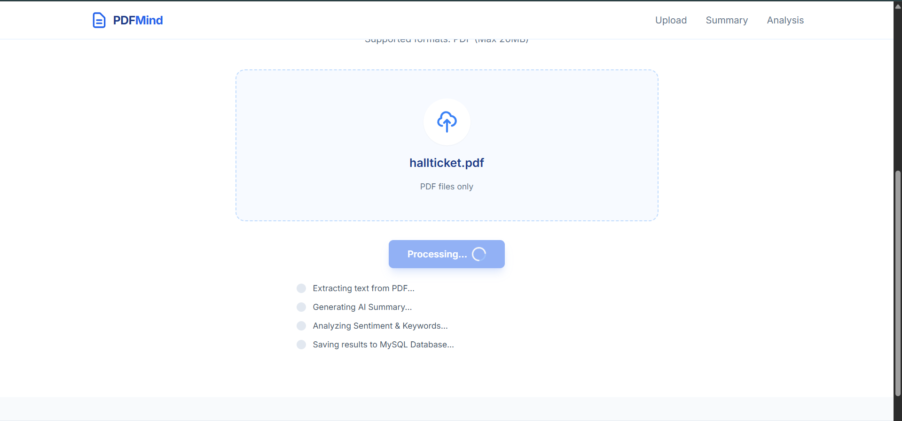
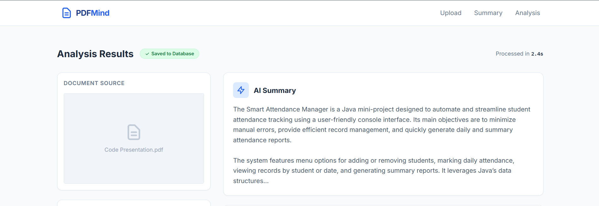
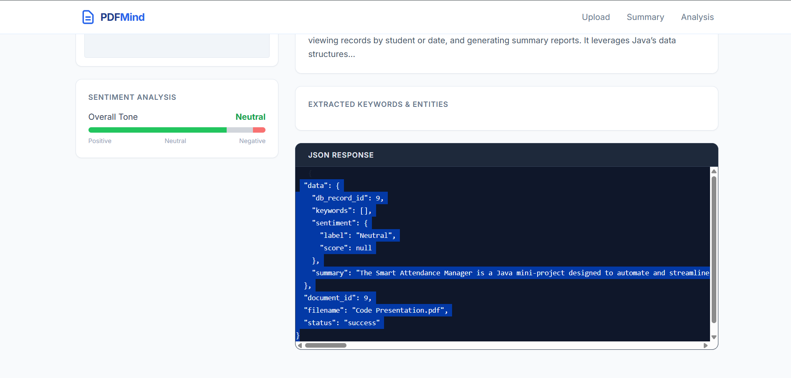

# PDFMind AI

PDFMind AI is an intelligent PDF analysis tool built with Flask backend, powered by Google's Gemini Flash AI for summarization and sentiment analysis, PDF text extraction using PyPDF2, and MySQL for data storage. It processes uploaded PDF files and returns structured JSON responses containing summaries, sentiment analysis, and metadata.

## Features

- **PDF Text Extraction**: Extracts text content from uploaded PDF files.
- **AI-Powered Summarization**: Uses Gemini Flash AI to generate concise summaries of PDF content.
- **Sentiment Analysis**: Analyzes the sentiment of the summarized text (Positive, Negative, or Neutral).
- **Keyword Extraction**: Extracts important keywords from the PDF content.
- **MySQL Storage**: Stores analysis results in a MySQL database for persistence.
- **RESTful API**: Provides JSON-based API endpoints for integration.
- **Web Interface**: Simple web UI for uploading PDFs and viewing results.

## Prerequisites

- Python 3.8 or higher
- MySQL Server
- Google Gemini API Key (obtain from [Google AI Studio](https://makersuite.google.com/app/apikey))

## Installation

1. Clone the repository:
   ```bash
   git clone https://github.com/vrushalid0709/PDF_Mind.git
   cd PDF_Mind
   ```

2. Install the required Python packages:
   ```bash
   pip install flask PyPDF2 google-genai mysql-connector-python
   ```

## Environment Setup

1. Create a virtual environment (recommended):
   ```bash
   python -m venv venv
   source venv/bin/activate  # On Windows: venv\Scripts\activate
   ```

2. Set up your environment variables:
   - Create a `.env` file in the project root or modify `config.py` securely.
   - Add your Gemini API key:
     ```
     GEMINI_API_KEY=your_actual_api_key_here
     ```
   - Update database credentials in `config.py` if needed.

## Database Setup

1. Install and start MySQL Server on your system.

2. Create the database:
   ```sql
   CREATE DATABASE pdfmind;
   ```

3. Create the documents table:
   ```sql
   USE pdfmind;
   CREATE TABLE documents (
       id INT AUTO_INCREMENT PRIMARY KEY,
       filename VARCHAR(255) NOT NULL,
       summary TEXT,
       sentiment VARCHAR(50),
       keywords JSON,
       uploaded_at TIMESTAMP DEFAULT CURRENT_TIMESTAMP
   );
   ```

4. Update `config.py` with your MySQL credentials:
   ```python
   DB_HOST = "localhost"
   DB_USER = "your_username"
   DB_PASSWORD = "your_password"
   DB_NAME = "pdfmind"
   ```

## How to Run the Server

1. Ensure your virtual environment is activated and all dependencies are installed.

2. Run the Flask application:
   ```bash
   python app.py
   ```

3. The server will start on `http://localhost:5000`.

4. Open your browser and navigate to `http://localhost:5000` to access the web interface.

## API Usage

### Upload PDF Endpoint

- **URL**: `/upload-pdf`
- **Method**: POST
- **Content-Type**: `multipart/form-data`
- **Parameters**:
  - `file`: PDF file to upload

**Example Response**:
```json
{
  "status": "success",
  "document_id": 1,
  "filename": "example.pdf",
  "data": {
    "summary": "This is a concise summary of the PDF content...",
    "sentiment": "Positive",
    "keywords": ["keyword1", "keyword2", "keyword3"]
  }
}
```

## Project Structure

```
PDFMind/
├── app.py              # Main Flask application
├── config.py           # Configuration file with API keys and DB settings
├── pdf_utils.py        # PDF text extraction utilities
├── ai_utils.py         # AI summarization and analysis functions
├── db_utils.py         # Database connection and operations
├── test_models.py      # Test scripts for models
├── templates/
│   └── index.html      # Web interface template
├── uploads/            # Directory for uploaded files
└── README.md           # This file
```

## Screenshots

### Home Page


### Upload PDF


### Process PDF


### Analysis Result


### Result Page>



## Contributing

1. Fork the repository
2. Create a feature branch (`git checkout -b feature/AmazingFeature`)
3. Commit your changes (`git commit -m 'Add some AmazingFeature'`)
4. Push to the branch (`git push origin feature/AmazingFeature`)
5. Open a Pull Request

## License

This project is licensed under the MIT License - see the [LICENSE](LICENSE) file for details.

## Acknowledgments

- Google Gemini AI for powerful language processing
- Flask framework for the web backend
- PyPDF2 for PDF text extraction
- MySQL for database storage
